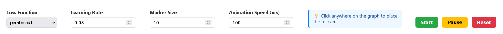
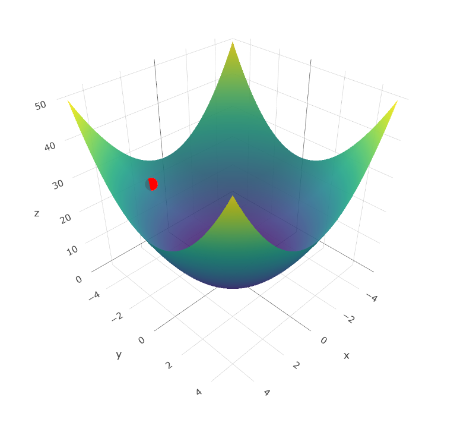

# Gradient Descent Visualizer

An interactive web application that **visualizes gradient descent** on different mathematical loss functions.  
Built using **ReactJS**, **Node.js**, **Plotly.js**, and **JSON** for configuration.  




---

## Features

- **3D Loss Surfaces** – Visualize functions like **Paraboloid, Saddle, Rosenbrock**  
- **Interactive Marker Placement** – Click anywhere on the graph to set the starting point  
- **Customizable Parameters**:
  - Learning rate  
  - Marker size  
  - Animation speed  
- **Controls** – Start, Pause, and Reset gradient descent animation  

---

## Tech Stack

### Frontend
- **ReactJS** – UI and state management  
- **react-plotly.js** – 3D interactive graph rendering  
- **Responsive HTML/CSS** – For styling and layout  

### Backend
- **Node.js + Express** – Serves JSON data and runs backend API  
- **CORS** – Enables frontend-backend communication  

### Data
- **functions.json** – Stores loss function names, formulas, and ranges  

---

## Getting Started

### 1. Clone the Repository
```bash
git clone https://github.com/your-username/gradient-descent-visualizer.git
```

### 2. Setup Backend (Node.js)
```bash
cd backend
npm install
node server.js
```
Backend runs at: **http://localhost:5000**

### 3. Setup Frontend (React)
```bash
cd ../gradient-descent-visualizer
npm install
npm start
```
Frontend runs at: **http://localhost:3000**

---

##  How It Works

- Select a **loss function** from the dropdown.  
- **Click** anywhere on the 3D graph to set a starting point.  
- Adjust the **learning rate** → controls how big each step is.
- Adjust the **animation speed** → controls how fast the marker moves.  
- Press **Start** to see gradient descent in action.  
- Use **Pause/Reset** to control the animation.  


## References

- [Gradient Descent – Wikipedia](https://en.wikipedia.org/wiki/Gradient_descent)  
- [Plotly.js Documentation](https://plotly.com/javascript/)  